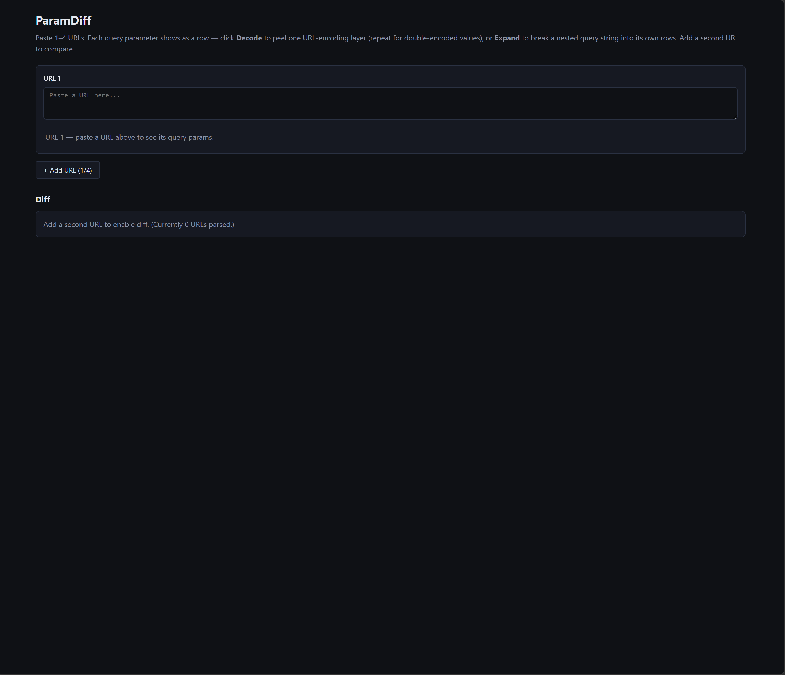

# ParamDiff

ParamDiff — decode, expand, and diff URL query params

A small web app for inspecting and comparing URLs — paste 1–4 URLs, peel back URL-encoding layer by layer, expand nested query strings, and diff query parameters across URLs side by side.

## Download

[**Download `index.html`**](https://github.com/homorozeanu/param-diff/releases/latest/download/index.html) — single self-contained file (~210 KB, ~65 KB gzipped). Open it in any modern browser; no install, no server, no network needed.

See [release notes](https://github.com/homorozeanu/param-diff/releases/latest) for the changelog and other assets.

## How to use

1. **Open the app.** Either visit a hosted instance, or download `index.html` from the [latest Release](https://github.com/homorozeanu/param-diff/releases/latest) and open it in any modern browser. The file is fully self-contained (~210 KB, ~65 KB gzipped) — no install, no server, no network needed at runtime. Your URLs never leave the page.
2. **Paste a URL** into the first input. ParamDiff splits it at the first `?` and lists every query parameter as its own row.
3. **Peel encoded values.** Click **Decode** on any row to apply one `decodeURIComponent` pass — click again for double-encoded values (`%253A → %3A → :`). The button disables once nothing further would change.
4. **Drill into nested query strings.** When a value carries its own params (typical of OAuth `returnUrl` / `redirect_uri`), click **Expand** to split it into indented child rows. Each child has its own Decode/Expand/Reset, so you can recurse arbitrarily deep.
5. **Reset.** Click **Reset** to restore the original raw value and collapse any expansion on that row.
6. **Compare.** Click **+ Add URL** for up to 4 URLs. The Diff section under the inputs lists every parameter key seen across them, with one cell per URL — green when all match, red when they differ, grey when missing in that URL.
7. **Save & revert.** Click **Save comparison** to snapshot the current URLs and their decode/expand state. Saved snapshots appear in the **Saved comparisons** panel below the diff — **Restore** any one to bring it back, or **Delete** to drop it. Your in-progress comparison and saved snapshots persist within the current browser tab (they survive a reload but clear when the tab closes).
8. **Start fresh.** Click **Reset all** (confirmation required) to clear every URL and saved comparison at once — the diff empties too.

> Tip: the diff reflects whatever decode/expand state you've applied. To compare two URLs fairly, peel them the same number of times.

## How it parses

1. **Top-level split** at the first `?` → `base` + `key=value` pairs (no automatic decoding; values are preserved raw so you can choose when to peel).
2. **Decode** applies `decodeURIComponent` once. If the result is identical (already fully decoded, or unchangeable), the button disables.
3. **Expand** is offered when a value contains `=` plus either a `?` or a chain of `&`-joined `key=value` pairs with conservative-looking keys (`/^[A-Za-z0-9_\-.]+$/`). It splits at the first `?` (if any), keeps the prefix as `nestedBase`, and creates child params from the rest.
4. **Diff** flattens each URL's param tree to `{ keyPath, value }[]`, builds a union of keys preserving first-seen order, and renders one row per key with one cell per URL.

## Notes / known limits

- Param keys are matched literally for diffing — if URL A uses `client_id` and URL B uses `clientId`, they show as separate rows.
- Bare query strings (`a=1&b=2` with no `?`) are detected by Expand only when keys look conservative — this avoids false positives on prose values.
- Repeated keys (`?tag=a&tag=b`) keep both, but the diff key path is the same for both, so the second one wins in the per-URL flat map. Rare in practice.
- Persistence is per-tab only, via `sessionStorage` — your current comparison and saved snapshots survive a reload but are cleared when the tab closes, and are not shared across tabs. Nothing is sent anywhere. History is capped at 20 snapshots (oldest drop off).

## Development

Build instructions, project layout, and internals live in [DEVELOPMENT.md](DEVELOPMENT.md).

## License

MIT — see [LICENSE](LICENSE).
